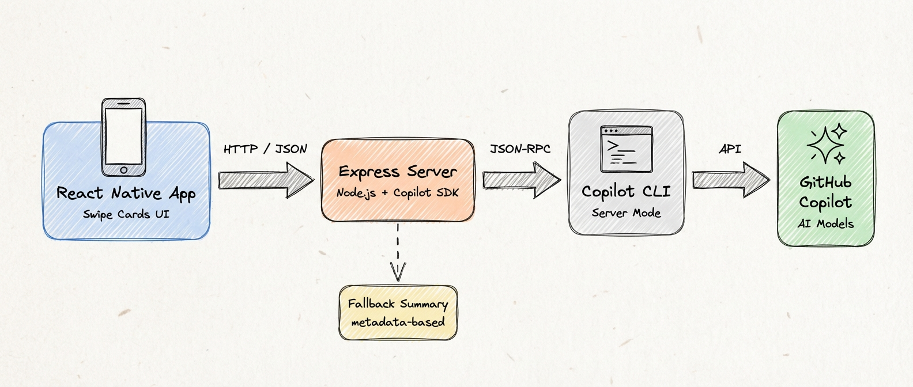

# IssueCrush 🎯

Swipe through your GitHub issues like Tinder. Close with a left swipe, keep with a right swipe. Powered by **GitHub Copilot AI** for intelligent issue summaries.

**[Try it live →](https://gray-bush-0c5cb190f.2.azurestaticapps.net/)**


## Features

- **Tinder-Style Swipe Interface** - One card at a time, swipe right to keep, left to close
- **GitHub OAuth Authentication** - Secure login with device flow (mobile) or web flow (browser)
- **AI-Powered Summaries** ✨ - Get intelligent issue analysis powered by GitHub Copilot SDK
- **Instant Undo** - Accidentally closed an issue? Undo it instantly
- **Repository Filtering** - Focus on specific repos or view all your issues
- **Cross-Platform** - Works on web, iOS, and Android via React Native + Expo
- **Native Feel** - Action bar with Close/Undo/Keep buttons, toast notifications, stamp-style swipe overlays

## Quick Start

### Prerequisites

- **Node.js** 18+ and npm
- **GitHub account** with repositories containing issues
- **GitHub OAuth App** ([create one here](https://github.com/settings/developers))
- *Optional:* **GitHub Copilot subscription** for AI summaries

### 1. Clone and Install

```bash
git clone <your-repo>
cd IssueCrush
npm install
```

### 2. Configure GitHub OAuth

Create a GitHub OAuth App:

1. Go to https://github.com/settings/developers
2. Click "New OAuth App"
3. Fill in:
   - **Application name:** IssueCrush
   - **Homepage URL:** `http://localhost:8081`
   - **Authorization callback URL:** `http://localhost:8081`
4. Click "Register application"
5. Copy your **Client ID**
6. Generate a **Client Secret**

### 3. Set Up Environment

```bash
cp .env.example .env
```

Edit `.env` and add your credentials:

```bash
EXPO_PUBLIC_GITHUB_CLIENT_ID=your_client_id_here
GITHUB_CLIENT_SECRET=your_client_secret_here
EXPO_PUBLIC_GITHUB_SCOPE=repo

# Optional: Azure Cosmos DB for persistent sessions (falls back to in-memory)
COSMOS_ENDPOINT=https://your-account.documents.azure.com:443/
COSMOS_KEY=your_cosmos_primary_key
COSMOS_DATABASE=issuecrush
COSMOS_CONTAINER=sessions
```

> **Important:** Use `repo` scope (not `public_repo`) to enable closing issues.

### Session Storage (Optional)

By default, sessions are stored in memory (lost on server restart). For persistent sessions across restarts and multiple instances, configure Azure Cosmos DB:

1. Create a Cosmos DB account (NoSQL API) in Azure Portal or CLI
2. Get your endpoint and key from **Settings → Keys**
3. Add the `COSMOS_*` variables to your `.env`

The server auto-creates the database and container on first run.

### 4. Run the Application

**For Web:**
```bash
npm run web-dev
```

This starts both the OAuth server (port 3000) and opens the app in your web browser.

**For Mobile Development:**
```bash
npm run dev
```

This starts both the OAuth server (port 3000) and the Expo dev server (port 8081). Then press `w` to open in web browser, or scan the QR code with Expo Go.

> **Note:** If you navigate to `http://localhost:8081` in your browser, you'll see a JSON manifest instead of the app. This is normal - use the commands above to properly launch the web app.

### 5. Use the App

1. Click "Start GitHub login"
2. Authorize on GitHub
3. Enter a repo filter (e.g., `owner/repo`) or leave blank for all issues
4. Click "Refresh" to load issues
5. **Swipe right** to keep an issue open
6. **Swipe left** to close an issue
7. Tap the issue number to open it on GitHub
8. Use the bottom action bar for button-based actions

## AI Summaries (Optional)

Click the **"✨ Get AI Summary"** button on any issue card to get an AI-generated analysis including:

- What the issue is about
- Technical context and requirements
- Recommended next steps

The AI summary is powered by the GitHub Copilot SDK running on your backend server.

### Requirements for AI Features

- GitHub Copilot subscription or access
- `GH_TOKEN` environment variable with Copilot access (or use `COPILOT_PAT`)

## Structured Triage (Optional)

The AI summary returns prose. Prose cannot be sorted, filtered, or badged. Structured triage
returns typed judgments the UI can actually act on.

Click **TRIAGE** on any issue card to get:

- A **recommended action** — implement, needs info, duplicate, stale close, or no clear action
- A **staleness** score — does this issue still reflect the project as it is today?
- An **effort** score — how much work is the change itself?
- An **actionable** probability — can a developer start now, or is this blocked on the reporter?

These come back as one request to [TypeSafe](https://typesafe.ai)'s System One model (`jev-latest`),
which answers typed questions with calibrated probabilities instead of generating text.

**Triage never swipes for you.** It decorates the card; you still make the call. A close
suggestion is gated at higher confidence than a keep suggestion, because closing an issue is
destructive and keeping one is free.

### Setup

**Local development** — add to your `.env`:

```bash
TYPESAFE_API_KEY=your_typesafe_api_key
```

**Deployed app** — the key is read at runtime by the Azure Function, so it belongs in the
Static Web App's application settings:

```bash
az staticwebapp appsettings set \
  --name issuecrush --resource-group issuecrush-rg \
  --setting-names TYPESAFE_API_KEY=<your-key>
```

Verify with `curl https://<your-host>/api/health` and look for `"triageAvailable": true`.

> **Not a GitHub Actions secret.** A repo secret only exists while the workflow runs; the
> deployed Function never sees it, so setting one changes nothing.
>
> **Never put it in the build step.** `.github/workflows/azure-swa.yml` passes
> `EXPO_PUBLIC_GITHUB_CLIENT_ID` as a build-time env var, which is fine for a public OAuth
> client ID. Anything added there is compiled into the client bundle and shipped to every
> browser. An API key placed there is a public leak.

Without the key the endpoint returns a clear 503, `/api/health` reports
`triageAvailable: false`, the TRIAGE button stays hidden, and every other feature works
exactly as before.

### Reviewing the questions

Every question, threshold, and the policy mapping answers to UI signals lives in one file:

```
api/src/triageQuestions.cjs
```

That is deliberate. The prompts an AI system sends are the part most worth reviewing, so
they are not scattered across handlers. Change a threshold there and nothing needs
re-running — the judgments are unchanged, only the policy that reads them.

Both backends share that one file. Azure SWA deploys `api_location: "api"`, so anything the
Functions app needs must live inside `api/`; the `.cjs` extension lets the CommonJS root
server `require()` it and the ESM Functions app default-import it. One source of truth, two
runtimes, no copy step.

### Deploying

Triage runs in both the local Express server and Azure Functions, sharing one config file.
See [Setup](#setup) above for where the API key goes.

## Architecture




## Project Structure

```
IssueCrush/
├── App.tsx                    # Main app component (UI + swipe logic)
├── server.js                  # Express server (OAuth + AI proxy)
├── sessionStore.js            # Cosmos DB / in-memory session storage
├── AGENTS.md                  # AI agent context (project knowledge)
├── .agents/                   # Installed agent skills (see below)
├── api/
│   └── src/
│       ├── app.js            # Azure Functions: OAuth, issues, AI, triage
│       ├── sessionStore.js   # Cosmos DB session storage
│       └── triageQuestions.cjs # TypeSafe questions, thresholds, triage policy
├── src/
│   ├── api/
│   │   └── github.ts         # GitHub API client
│   └── lib/
│       ├── tokenStorage.ts   # Secure token storage
│       ├── triageService.ts  # Frontend structured triage client
│       └── copilotService.ts # Frontend Copilot service
├── .env.example              # Environment template
├── package.json              # Dependencies and scripts
└── README.md                 # This file
```

### Agent Context System

The `.agents/` directory contains the [Agent Context System](https://github.com/AndreaGriffiths11/agent-context-system) — a persistent memory layer for AI coding agents. It helps agents like GitHub Copilot, Claude, and Cursor retain project knowledge across sessions.

- **`AGENTS.md`** — Committed project knowledge that all AI agents read automatically
- **`.agents/skills/`** — Installed agent skills (not part of the app's runtime code)
- **`.agents.local.md`** — Personal scratchpad (gitignored, created locally via the skill's init script)

These files do not affect the app. You can safely ignore them if you're not using AI coding agents.

## Available Scripts

```bash
npm run web-dev   # Start server + open web app (recommended for web)
npm run dev       # Start server + Expo dev server (for mobile)
npm run server    # Start OAuth/AI server only (port 3000)
npm start         # Start Expo app only
npm run web       # Open in web browser only
npm run ios       # Open in iOS simulator
npm run android   # Open in Android emulator
```

### Testing

```bash
npm test              # Run Jest test suite
npx tsc --noEmit      # Type-check without building
```

## Troubleshooting

### Authentication Issues

**"Failed to connect to auth server"**
- Make sure you run `npm run dev` (not just `npm start`)
- The OAuth server must be running on port 3000

**"GitHub OAuth failed: bad_verification_code"**
- Code expired or already used. Click "Start GitHub login" again

**Issues won't close**
- Check that your OAuth scope is `repo` (not `public_repo`)
- Sign out and sign in again to get a new token with the correct scope

### AI Summary Issues

**"AI summary failed: Failed to fetch"**
- Make sure the Express server is running (`npm run server`)
- Check that `GH_TOKEN` or `COPILOT_PAT` is set for Copilot access

### Build/Bundling Issues

**"Cannot find module 'babel-preset-expo'"**
- Run `npm install` to ensure all dependencies are installed
- If the issue persists, manually install: `npm install --save-dev babel-preset-expo`

**"Cannot find module 'react-dom' or 'react-native-web'"**
- Install web dependencies: `npx expo install react-dom react-native-web`

**Blank page or JSON manifest displayed**
- Don't navigate directly to `http://localhost:8081` - that's the Metro bundler endpoint
- Use `npm run web-dev` instead, which opens the correct web URL automatically

## Tech Stack

- **React Native** + **Expo** - Cross-platform mobile framework
- **react-native-deck-swiper** - Tinder-style swipe cards
- **Express** - OAuth token exchange and AI proxy server
- **Azure Cosmos DB** - Persistent session storage (optional)
- **GitHub Copilot SDK** (0.1.32) - AI-powered issue analysis
- **[Agentation](https://github.com/benjitaylor/agentation)** - Visual feedback UI component (web only) by [Benji Taylor](https://github.com/benjitaylor)
- **TypeScript** - Type-safe development

### Other Platforms

For Azure Static Web Apps, Vercel, or similar platforms, set the environment variables in their configuration panel.

## Contributing

We welcome contributions! Check out the [Contributing Guide](CONTRIBUTING.md) to get started.

- Look for issues labeled `good first issue` or `help wanted`
- Fork the repo and create a feature branch
- Cosmos DB is **optional** for local development (sessions fall back to in-memory)

## Credits

- Created by [Andrea Griffiths](https://github.com/AndreaGriffiths11)
- **Agentation** visual feedback component by [Benji Taylor](https://github.com/benjitaylor) - [GitHub](https://github.com/benjitaylor/agentation)

## Security

- OAuth tokens stored securely using `expo-secure-store` (mobile) or `AsyncStorage` (web)
- Client Secret only used server-side, never exposed to client
- All GitHub API calls use user's OAuth token

## License

MIT

---

Made with ❤️ & 🤖 for developers who want to triage issues faster
